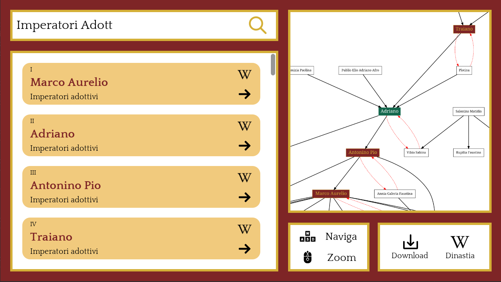
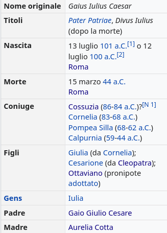

# BloodlineSeeker

BloodlineSeeker is a GUI program written in Java which allows to explore the dynasties of roman emperors. It works by scraping off of Wikipedia the information about the emperors, and then, recursively, scrapes the information of any other person on their bloodline.



## Features 🚀

- search every person from every roman dynasty!
- dynamically explore the searched person's close family graph in the Graph Viewer
- download the graph of the full dynasty with just 1 click
- search suggestion if query gives no result
- debug mode from terminal
- dynasties saved locally without having to download them again 🥱

## How does it work

The starting point of the scraping is [this Wikipedia page](https://it.wikipedia.org/wiki/Imperatori_romani) which lists every roman emperor with the associated Wikipedia links; with these, the program is able to create an object for every emperor on this page, and then recursively create the objects of their relatives. The information about the other people of the bloodline are given from the `sinottico` element which is present in almost every Wikipedia page.

For example, here is the sinottico for Julius Caesar: from this, BloodlineSeeker is able to retrieve the information about his children and his parents, as well as his spouses, and scrape their information recursively.



## Requirements

BloodlineSeeker uses some external programs which may be required to run the jar file

- Java 8+ is required to run the jar file
- if chosen, the program will scrape Wikipedia by using Selenium, which needs the driver of some browser; there are some drivers already available in the program's resources, but one of the browsers listed below still needs to be installed in the user's computer
  - Microsoft Edge
  - Google Chrome
  - Mozilla Firefox
- to generate the graph of the dynasties, the program uses a widespread library called [Graphviz](https://graphviz.org/), which needs some backend programs to run properly; in the program's resources, the Windows executable is already provided and should run without any issue, but if you run some Linux distribution, and you don't have the Graphviz package already installed, you should be able to download the library with your package manager.

Support on macOS is not guaranteed, because of hardware limitations due to the inability to test the program.

## Installation

`BloodlineSeeker.jar` can be found in the [releases page of this repository](https://github.com/Exyss/BloodlineSeeker/releases). Just download the latest release of the program and you are ready to go.

## Run

To run the jar file, simply double-click on it, or run

```sh
java -jar BloodlineSeeker.jar [options]
```

on your terminal. Also, by doing so you can run some other commands that are supported by the program:

- `--help` or `-h` to show the help message
- `--version` or - `-v` to show the version of the program
- `--debug` or `-d` to run the program with the debug mode enabled
- `--no-headless` or `-nh` to run the program without the headless mode enabled (in case the dynasties are downloaded through Selenium)
- `--run-tests` or `-t` to run the tests

## Usage

Once `BloodlineSeeker.jar` is run, the user will be prompted with the BloodlineSeeker Launcher on the Load page, which checks if there are any available json files under `data/jsons/` (inside the same folder of the jar file); if any valid json file is found, the program will load it and the launcher will display the option to run the program directly, otherwise the program will show an error message, and the user will be invited to download the dynasties' information by scraping Wikipedia.

In the Download page, the user will be able to choose between HTTP requests and Selenium for loading the HTML pages from Wikipedia, since HTTP requests are *significantly faster*, even when the selenium driver is run with the headless mode activated (which it is by default).

After the download is completed, the files of the found dynasties will be created under `data/jsons/`. Then, the program will launch, giving the user the ability to search through every person of every dynasty, and the option to explore the person's close family graph dynamically in the program.

## Contributing

To contribute to the program, first clone this repository. Then, to compile the program, just run

```sh
NON SO COME SI COMPILA
```

Then, to run the program, simply run

```sh
NON SO COME SI RUNNA
```
